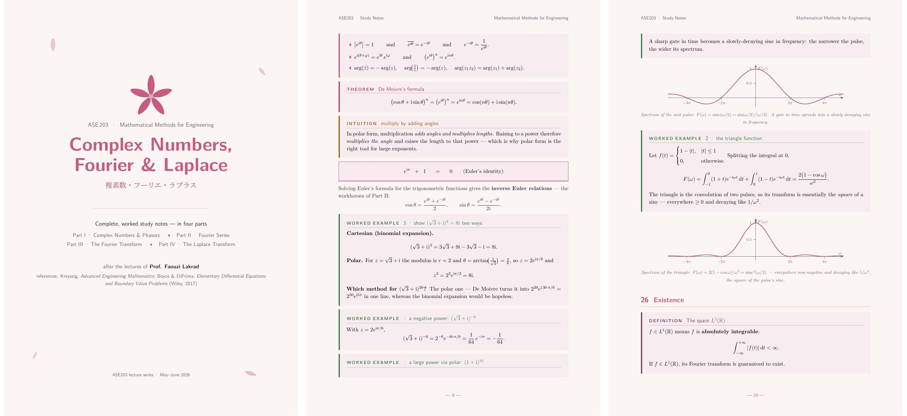

# 🌸 Sakura Notes — a washi-paper LaTeX theme

A drop-in LaTeX theme for **study notes that are actually pleasant to read**:
a warm *washi-paper* background, sakura-pink accents, colour-coded callout
boxes, hand-drawn cherry blossoms, part banners, and a matching `pgfplots`
style for figures. Light (paper) and dark (sumi-ink) modes included.



> I'm **Taha Chniber**, doing a BSc in Applied Mathematics at **SASE, Mohammed VI
> Polytechnic University (UM6P)**. I write my course notes in LaTeX. One set of
> them ended up on Reddit and pulled close to 10k views, and the question I kept
> getting was about the *look*, not the maths — so I pulled the styling out of my
> notes and turned it into a package anyone can drop in. This is it. The notes
> that started it all are in [`ASE203-notes.pdf`](ASE203-notes.pdf).

---

## ✨ Features

- **One package, one line.** `\usepackage[light]{sakuranotes}` and you're done.
- **Light & dark modes.** `[light]` = washi paper, `[dark]` = sumi-ink night.
- **Six colour-coded boxes** — definitions, theorems, worked examples,
  intuition, properties, notes — plus a centred "key formula" box.
- **Cherry-blossom artwork** drawn in TikZ (no image files), scaled to taste.
- **Title page & part banners** with optional kanji accents.
- **A `pgfplots` style** (`sakuraxis`) so your graphs match the palette.
- **Exposed colour names** you can override in one line.
- **Maths-friendly** helper macros (`\ii`, `\dd`, `\Ft`, `\Lap`, `\sinc`, …).

## 📦 Requirements

- A LaTeX engine with `fontspec`: **XeLaTeX** or **LuaLaTeX** (not pdfLaTeX).
- A reasonably complete TeX Live / MiKTeX (it uses `tcolorbox`, `tikz`,
  `pgfplots`, `titlesec`, `enumitem`, `fancyhdr`, …).
- **Fonts:** Latin Modern (ships with TeX Live). The kanji accents use
  **Noto Serif CJK JP** — if it isn't installed, the theme falls back to the
  main font automatically (you'll just lose the 漢字 flourishes).

## 🚀 Quick start

Grab `sakuranotes.sty` from this repo, drop it next to your `.tex`, then:

```latex
\documentclass[11pt]{article}
\usepackage[light]{sakuranotes}   % or [dark] for sumi-ink night mode

\begin{document}

\sakuratitle{My Notes}{ノート}{a subtitle / tagline}

\notespart{I}{First Part}{第一部}

\begin{defn}[Continuity]
A function $f$ is continuous at $a$ if $\lim_{x\to a} f(x) = f(a)$.
\end{defn}

\begin{key}
$e^{i\theta} = \cos\theta + i\sin\theta$
\end{key}

\end{document}
```

Build it with **XeLaTeX, run twice** (so headers and references settle):

```bash
xelatex main.tex
xelatex main.tex
```

On **Overleaf**: upload `sakuranotes.sty` alongside your `.tex`, then set the
compiler to **XeLaTeX** in *Menu → Compiler*.

## 🎨 The boxes

| Environment | Colour | Use it for |
|---|---|---|
| `defn`      | plum  | definitions |
| `thm`       | rose  | theorems / results |
| `ex`        | green | worked examples (show every step) |
| `intuition` | gold  | the "why", in plain words |
| `props`     | pink  | lists of rules / properties |
| `note`      | grey  | caveats and asides |
| `key`       | —     | a centred boxed formula worth memorising |

Each box takes an optional title, e.g. `\begin{thm}[Cauchy–Schwarz] … \end{thm}`.

## 🌗 Light & dark

```latex
\usepackage[light]{sakuranotes}   % washi paper (default)
\usepackage[dark]{sakuranotes}    % sumi-ink night
```

Both modes are tested and the showcase notes build identically under either.

## 🖌 Re-tinting

All the colours are exposed, so you can repaint the whole theme by overriding a
definition after loading the package:

```latex
\definecolor{sakura}{HTML}{E89AB0}   % the main accent
% \sakuradeep, \matcha, … are exposed too
```

## 📁 What's in this repo

```
.
├── sakuranotes.sty          ← the theme (the one file you actually need)
├── ASE203-notes.pdf         ← the full 33-page notes, built on the theme
├── template.pdf             ← a minimal example, rendered
├── study-notes-prompt.txt   ← a fill-in-the-blanks prompt to make your own
├── preview.png
├── sakura-notes.zip         ← full bundle: .tex sources + Makefile + LICENSE
└── README.md
```

## 📚 The showcase

[`ASE203-notes.pdf`](ASE203-notes.pdf) is the real thing the theme came from:
my notes for **ASE203 — Mathematical Methods for Engineering** (Prof. Faouzi
Lakrad), covering complex numbers & phasors, Fourier series, the Fourier
transform, and the Laplace transform (with ODE solving). It's the best reference
for how every box, banner, and plot style is meant to be used. The editable
`.tex` source lives inside [`sakura-notes.zip`](sakura-notes.zip).

## 🤖 Make your own notes

[`study-notes-prompt.txt`](study-notes-prompt.txt) is a copy-paste prompt for a
capable AI assistant. Attach your own material — lecture slides, a textbook
chapter, photos of a whiteboard — fill in the bracketed fields, and you get back
a set of notes in this exact theme: faithful content, full worked examples,
intuition boxes, and matching diagrams. It's how I turn raw slides into something
polished without rebuilding the formatting every time.

## 🔨 Building from source

The `.tex` sources and a `Makefile` are inside `sakura-notes.zip`. Unzip it, then:

```bash
make          # builds the template and the showcase PDFs
# or compile any .tex directly:
xelatex main.tex   # run twice
```

## 📄 License

MIT. © Taha Chniber. Use it, change it, ship it; a credit is appreciated but not
required. The full licence text ships inside `sakura-notes.zip`.

---

🌸
